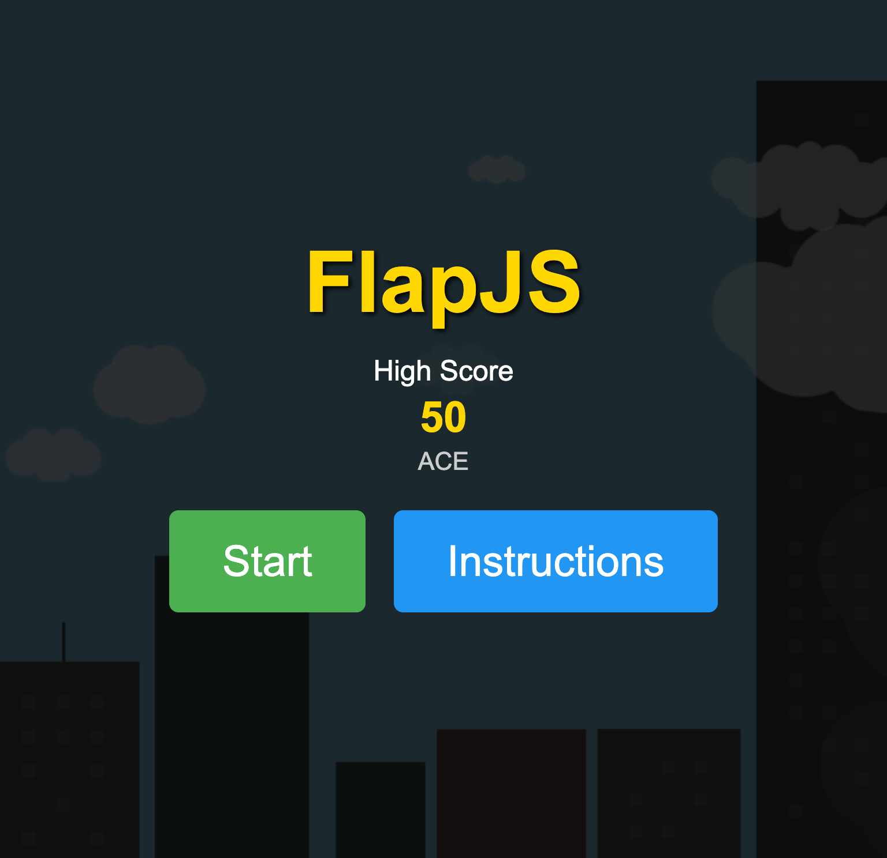
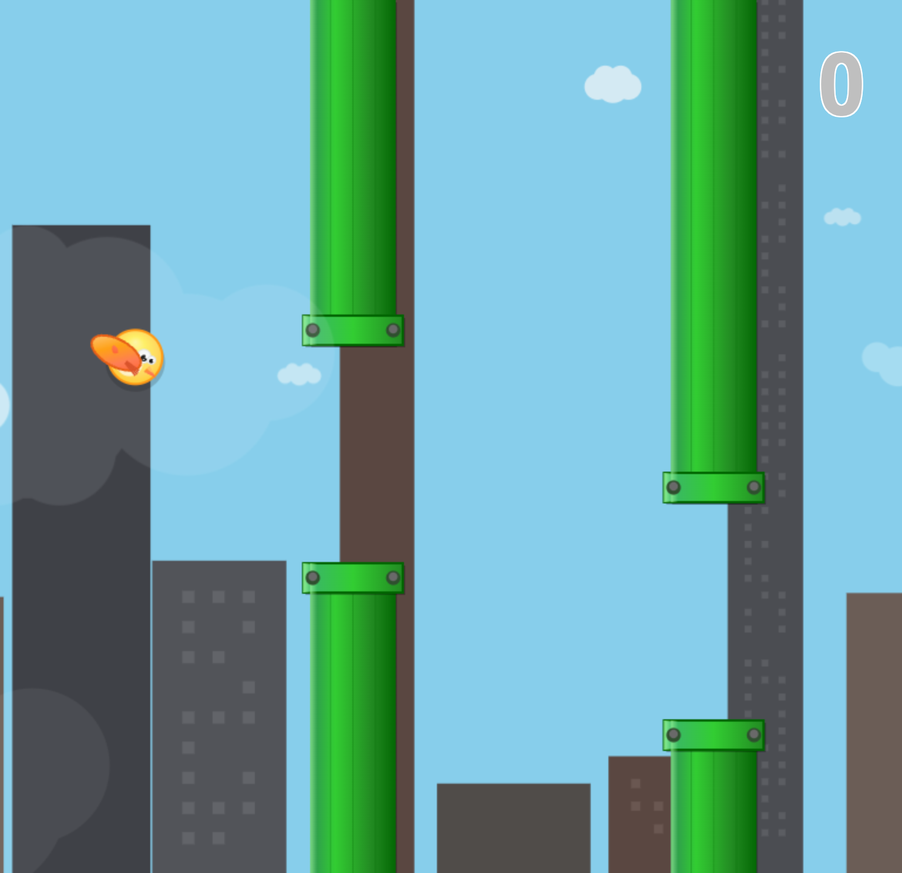
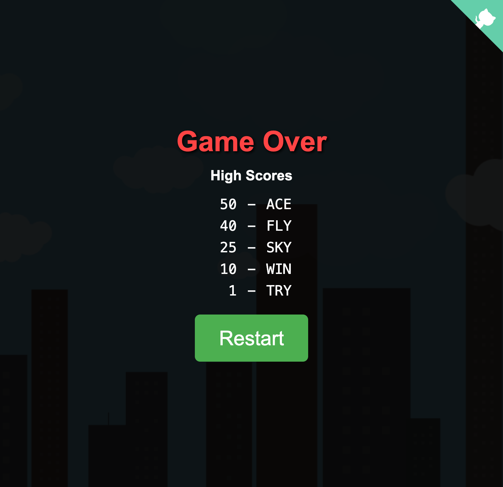
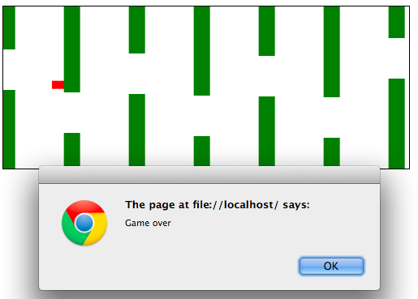

# FlapJS

A JavaScript implementation of Flappy Bird with enhanced visuals and atmospheric effects. 

Play at: http://jamiely.github.io/flapjs

## Features

Originally written in a few hours on February 2, 2014 when [Flappy Bird](https://itunes.apple.com/us/app/flappy-bird/id642099621?mt=8) was the top free app in the Apple App Store. Recently enhanced with Claude to add:

- **Dynamic city skyline** with varied building heights and muted color palette
- **Atmospheric cloud system** with background and foreground layers for depth
- **Enhanced bird design** with sophisticated visual details and rotation physics
- **Detailed pipe graphics** with 3D industrial styling and gradients
- **High score system** with persistent local storage and initials entry
- **Responsive scaling** that adapts to different screen sizes
- **Sound effects** for jumping and game over events

## Usage

To play, open `index.html` in a browser. The game works on modern browsers including:

- Chrome/Chromium
- Safari
- Firefox
- Edge

### Controls

- **SPACE** - Jump/flap
- **P** - Pause/unpause game
- **ENTER** - Start/restart game

## Screenshots

### Title Screen

### Gameplay

*Features dynamic city skyline, atmospheric clouds, detailed bird animation, and industrial-style pipes*

### Game Over

*High score tracking with GitHub corner banner for accessing source code*

## Legacy Media

* 532364d (Original version)
  *  
  * [Youtube](http://youtu.be/2xWL0K8jh6I)

