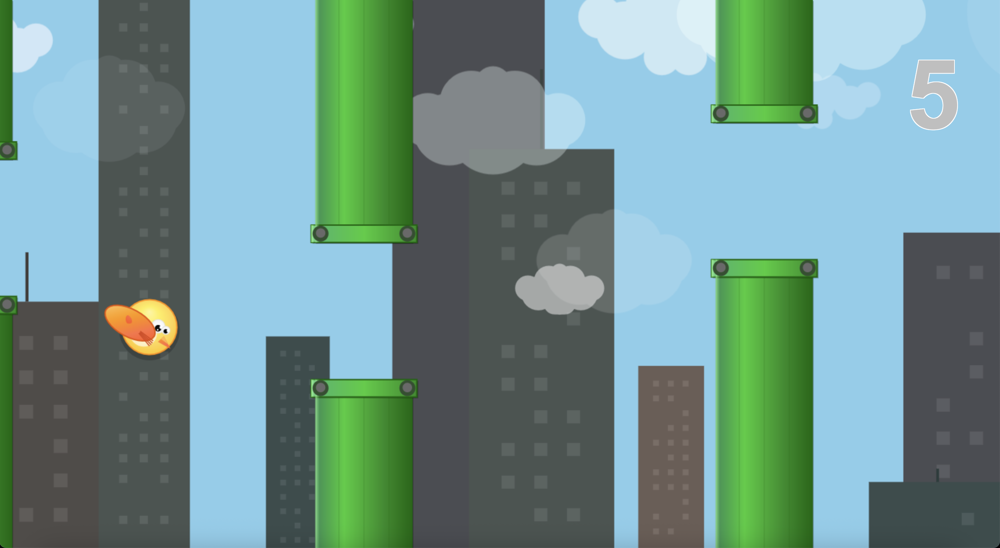

# FlapJS



A JavaScript implementation of Flappy Bird with enhanced visuals and atmospheric effects.

Play at: http://jamiely.github.io/flapjs

## Features

Originally written in a few hours on February 2, 2014 when [Flappy Bird](https://itunes.apple.com/us/app/flappy-bird/id642099621?mt=8) was the top free app in the Apple App Store. In 2025, enhanced with Claude to add:

- **Dynamic city skyline** with varied building heights and muted color palette
- **Atmospheric cloud system** with background and foreground layers for depth
- **Enhanced bird design** with sophisticated visual details and rotation physics
- **Detailed pipe graphics** with 3D industrial styling and gradients
- **High score system** with persistent local storage and initials entry
- **Responsive scaling** that adapts to different screen sizes
- **Sound effects** for jumping and game over events

## Usage

To play, open `index.html` in a browser. The game works on modern browsers including:

- Chrome/Chromium
- Safari
- Firefox
- Edge

### Controls

- **SPACE** - Jump/flap
- **P** - Pause/unpause game
- **ENTER** - Start/restart game

## Development

### Running Tests

The game includes a comprehensive test suite with 298 tests covering all modules:

```bash
# Install dependencies
npm install

# Run tests once
npm run test:run

# Run tests in watch mode (for development)
npm test

# Run tests for a specific file
npm run test:run src/gamestate.test.js
```

### Test Coverage

The project has complete test coverage for all JavaScript modules:

- `animationFunction.js` - Animation loop and rendering controls
- `config.js` - Game configuration and scaling
- `draw.js` - Canvas rendering and drawing functions  
- `eventHandlers.js` - Input handling (keyboard, touch, mouse)
- `gamestate.js` - Game state management and entities
- `physics.js` - Physics calculations and collision detection
- `score.js` - High score management and localStorage
- `screens.js` - Screen transitions and UI management
- `sound.js` - Web Audio API integration
- `tick.js` - Main game loop and state updates
- `worldgen.js` - World generation (clouds, skyline)

All tests use the Vitest framework with comprehensive mocking of DOM and external dependencies.

## Screenshots

### Title Screen


### Gameplay


_Features dynamic city skyline, atmospheric clouds, detailed bird animation, and industrial-style pipes_

### Game Over


_High score tracking with GitHub corner banner for accessing source code_

## Legacy Media

- 532364d (Original version)
  - 
  - [Youtube](http://youtu.be/2xWL0K8jh6I)
